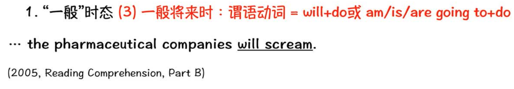

# 一、简单句的构成

## 1. 主谓

## 2. 主谓宾

## 3. 主谓双宾 （主谓宾宾）

## 4. 主谓宾补

## 【拓】如何区分『双宾』与『宾补』

1. 方法一：双宾，一个是人，一个是物

2. 方法二：成分之间加 be，通顺为宾补，不通顺为双宾！

    

## 5. 主系表

# 二、谓语动词的变化

## 1. 谓语动词的时态

### a. 一般过去时

* 表示完全发生在过去的事情，现在已经不再发生。

### b. 一般现在时

### c. 一般将来时

* 现在之后的将来，要发生的事。
* **will 后面要加动词原型，所以不是will are，而是will be**
* 总共三种：
    * shall + do：不需要掌握，用在第一人称
        * `I shall visit you tomorrow.`
    * will + do
    * be going to do

### d. (一般)过去将来时

### 【一般时态】小结

### e. 过去进行时

### f. 现在进行时

### g. 将来进行时

### 【进行时态】小结

### h. 过去完成时

### 【过去完成时 vs 一般过去时】

* 过去的过去

### i. 现在完成时

### 【现在完成时 vs 一般过去时】

* 宏观纬度
    * 现在完成时：**过去 + 现在**，过去做，现在也可能在做；
    * 一般过去时：只有过去，过去做，现在不做了；
* 微观纬度
    * 现在全部完成，可以换成过去时；
    * 

> 翻译：
>
> 1. 从过去到现在，一直都是支持的。
> 2. 过去时支持的，现在不支持了。

> 翻译：
>
> 1. 我们学英语已经学了15年了（意思是现在还在学）
> 2. 我们过去学英语学了15年（表示现在已经不学了）

### j. 将来完成时

> **情态动词 后面+ 动词原型**

### 【完成时态】小结

### k. 完成进行时

### 【现在完成时 vs 现在完成进行时】

### l. 将来完成进行时

### 【完成进行时态】小结

